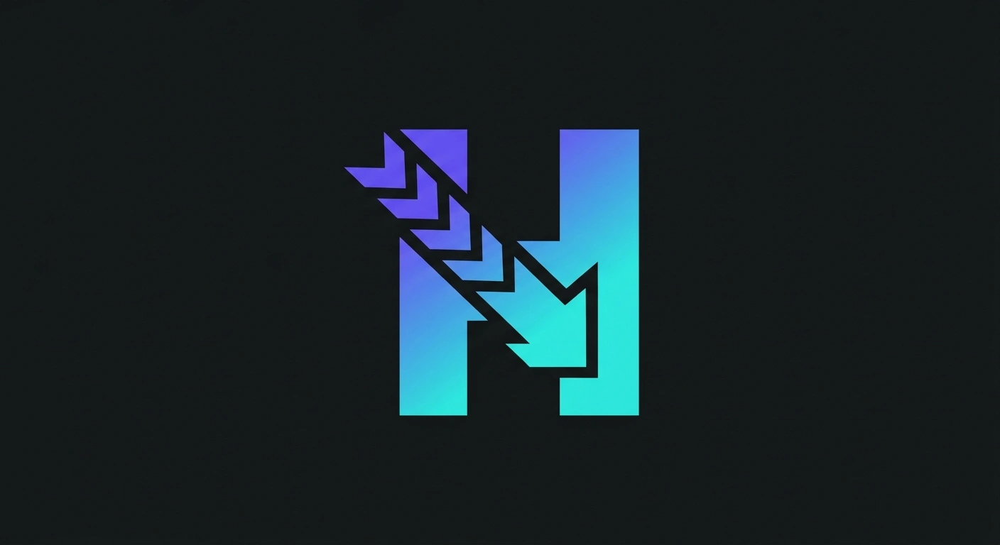

<p align="center">
  
</p>

<h1 align="center">Hub : Universal Media Downloader</h1>

<p align="center">
  A high-performance, developer-first, open-source media ingestion and distributed transcoding platform.
</p>

<p align="center">
  <a href="https://golang.org"></a>
  <a href="https://react.dev"></a>
  <a href="https://www.typescriptlang.org"></a>
  <a href="https://vitejs.dev"></a>
  <a href="https://opensource.org/licenses/MIT"></a>
  
</p>

> [!IMPORTANT]
> **Academic Project Disclaimer**:
> This project is created solely for the **Web Programming (*Pemrograman Web*)** university coursework. It is engineered for educational, demonstration, and research purposes in modern full-stack web architecture, distributed media streaming pipelines, and clean code practices.

### Technologies Overview

| Component | Technologies Used | Purpose |
| :--- | :--- | :--- |
| **Frontend Web App** | React 19, TypeScript, Vite 6, Vanilla CSS | Multi-page client interface, stream preview, format selection |
| **Backend REST API** | Go 1.22 Standard Library | Asynchronous media routing, worker pool, and job status queue |
| **Media Engine** | Go 1.22, yt-dlp, FFmpeg | Stream extraction, format parsing, and audio/video demuxing |
| **Public Endpoint** | [hub.zidanmutaqin.cloud](https://hub.zidanmutaqin.cloud) | Production web application interface |

---

## Full Tech Stack

### Frontend
- **Framework**: React 19
- **Tooling**: Vite 6 (Multi-Page Application Rollup configuration)
- **Language**: TypeScript 5.7 (Strict mode)
- **Styling**: Vanilla CSS3 with custom design tokens, dark and light modes, and glassmorphic UI
- **Internationalization**: Custom reactive i18n hook supporting English and Indonesian
- **Animations**: Lenis smooth scrolling and CSS micro-interactions

### Backend
- **Language**: Go 1.22
- **Architecture**: Modular RESTful microservice with Go channel worker pool
- **Media Extractors**: Specialized engines for TikTok, YouTube, Instagram, Facebook, and Twitter/X
- **Transcoder**: FFmpeg for audio stem extraction and high-resolution video packaging
- **Security**: Ephemeral streaming lifecycle with zero logging of downloaded content

---

## Dedicated Application Endpoints

Hub is split into three standalone HTML entry points:

### 1. Media Downloader (`index.html`)
- Route: `/`
- Entry: `src/main.tsx` -> `src/pages/Home.tsx`
- Purpose: Primary landing interface providing cross-platform URL analysis, quick stream inspection, format selection, and high-speed binary download delivery.

### 2. About Us & Architecture (`about.html`)
- Route: `/about` or `/about.html`
- Entry: `src/about.tsx` -> `src/pages/About.tsx`
- Purpose: Explains Hub's open-source mission, privacy guarantees (no malicious ads or trackers), and distributed Go backend transcoding pipeline.

### 3. Public API Documentation (`docs.html`)
- Route: `/docs` or `/docs.html`
- Entry: `src/docs.tsx` -> `src/pages/Docs.tsx`
- Purpose: Complete interactive reference guide with cURL examples, JSON schemas, and code integration snippets for using `api.zidanmutaqin.cloud`.

---

## Connecting to the Public API

You can programmatically extract media metadata and request transcoding streams from your own applications:

### 1. Inspect Media URL

```bash
curl -X POST https://api.zidanmutaqin.cloud/v1/media/info \
  -H "Content-Type: application/json" \
  -d '{
    "url": "https://www.youtube.com/watch?v=dQw4w9WgXcQ"
  }'
```

Response:
```json
{
  "id": "yt_dQw4w9WgXcQ",
  "url": "https://www.youtube.com/watch?v=dQw4w9WgXcQ",
  "platform": "youtube",
  "title": "Rick Astley - Never Gonna Give You Up (Official Music Video)",
  "author": "Rick Astley",
  "authorHandle": "@RickAstleyYT",
  "duration": "03:33",
  "thumbnailUrl": "https://i.ytimg.com/vi/dQw4w9WgXcQ/maxresdefault.jpg",
  "availableFormats": ["video", "audio"],
  "availableQualities": ["1080p", "720p", "480p", "320kbps", "128kbps"]
}
```

### 2. Request Stream Extraction

```bash
curl -X POST https://api.zidanmutaqin.cloud/v1/media/download \
  -H "Content-Type: application/json" \
  -d '{
    "url": "https://www.tiktok.com/@creator/video/73928190283",
    "format": "video",
    "quality": "1080p"
  }'
```

### 3. JavaScript / TypeScript Fetch Example

```typescript
async function getMediaStream(targetUrl: string) {
  const response = await fetch('https://api.zidanmutaqin.cloud/v1/media/info', {
    method: 'POST',
    headers: { 'Content-Type': 'application/json' },
    body: JSON.stringify({ url: targetUrl }),
  });

  const metadata = await response.json();
  console.log('Title:', metadata.title);
  console.log('Available Formats:', metadata.availableFormats);
  return metadata;
}
```

---

## Project Structure

```text
/
├── .gitignore
├── index.html                  # Media Downloader entry point
├── about.html                  # About Us entry point
├── docs.html                   # Public API Docs entry point
├── package.json
├── tsconfig.json
├── tsconfig.node.json
├── vite.config.ts              # Vite Rollup MPA configuration
├── README.md
├── LICENSE                     # MIT License
├── public/
│   └── _redirects              # Netlify clean URL rules
├── src/
│   ├── main.tsx                # Mounts Downloader to index.html
│   ├── about.tsx               # Mounts About to about.html
│   ├── docs.tsx                # Mounts Docs to docs.html
│   ├── components/
│   │   ├── Navbar.tsx          # Navigation across Downloader, About, Docs
│   │   ├── Footer.tsx          # Footer with API links
│   │   ├── DownloaderInput.tsx # Reusable URL input with paste/clear actions
│   │   ├── PlatformBadge.tsx   # Brand SVG logos (YouTube, TikTok, etc.)
│   │   ├── DownloadResult.tsx  # Media metadata preview & format selector
│   │   └── animations/         # Lenis scroll, SpotlightCard, DecryptedText
│   ├── pages/
│   │   ├── Home.tsx            # Downloader web application
│   │   ├── About.tsx           # About Us & architecture
│   │   └── Docs.tsx            # Public API documentation
│   ├── lib/
│   │   ├── platform.ts         # Hostname parser and platform detector
│   │   └── api.ts              # Future Go API contract and mock resolver
│   ├── types/
│   │   └── media.ts            # Core TypeScript interfaces
│   └── styles/
│       └── global.css          # Developer dark theme design system
```

---

## Getting Started

### Prerequisites

- Node.js 18.0.0 or higher
- npm (or pnpm / yarn)

### Installation & Run

1. Clone the repository:
```bash
git clone https://github.com/your-username/hub.git
cd hub
```

2. Install dependencies:
```bash
npm install
```

3. Start development server:
```bash
npm run dev
```

4. Access the application:
- Downloader: http://localhost:5173/
- About Us: http://localhost:5173/about.html (or http://localhost:5173/about)
- Public API Docs: http://localhost:5173/docs.html (or http://localhost:5173/docs)

---

## Building for Production

Compile the production bundle:
```bash
npm run build
```

The output directory `dist/` will contain:
- `dist/index.html`
- `dist/about.html`
- `dist/docs.html`
- `dist/_redirects`
- Bundled CSS and JavaScript assets

---
## Contributors and Team
- **[Zidan Mutaqin](https://github.com/zidanaetrna)**: Lead Engineer and Maintainer ([zidanmutaqin.cloud](https://zidanmutaqin.cloud))
- **[notyourpan](https://github.com/notyourpan)**: Contributor

---
## License

Distributed under the [MIT License](LICENSE).
